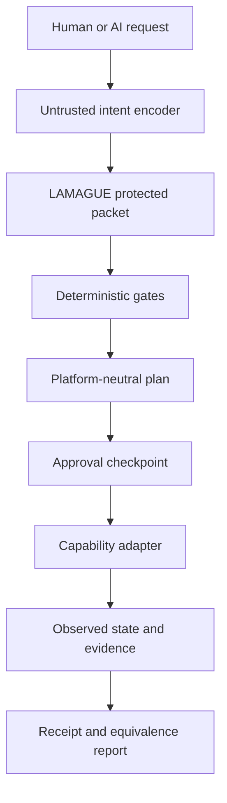
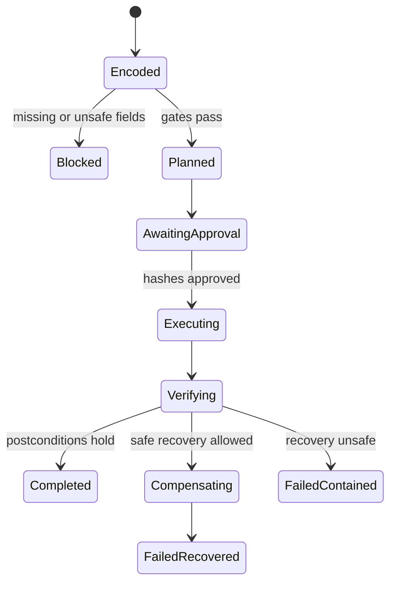

# LAMAGUE BRIDGE v0.1

## Real-World Interoperability Blueprint

**Status:** product and implementation blueprint  
**Date:** 2026-08-25  
**Purpose:** turn existing LAMAGUE work into a narrow, testable translator between human intent, AI planning, and capability-limited execution across macOS, Windows, and agent systems.

---

## 1. Executive decision

There is a real product inside the existing LAMAGUE work, but it is not yet a universal language and should not be marketed as one.

The strongest near-term product is:

> **LAMAGUE BRIDGE — write the intent once, execute it safely anywhere, and receive verifiable evidence of what happened.**

BRIDGE is a semantic contract layer. It sits above transports such as HTTPS, MCP, A2A, local IPC, or a shared folder, and below human-facing or AI-facing interfaces. It preserves the parts of an instruction that ordinary translation and automation often lose:

- purpose;
- claims and evidence;
- protected unknowns;
- authority and consent;
- participants and affected parties;
- constraints and invariants;
- dissent;
- value flow;
- recovery requirements;
- time horizon;
- expected outcome.

The first proving ground should be deliberately unglamorous:

> Copy a defined set of files from macOS to a Windows archive, without overwriting anything, while preserving originals, stopping on ambiguity, verifying hashes, and emitting a signed or hash-bound receipt.

If LAMAGUE cannot make that narrow workflow safer, clearer, and more portable than an ordinary automation definition, broader claims should stop. If it can, the same contract can later drive support workflows, business administration, human-to-AI handoffs, and AI-to-AI delegation.

---

## 2. What already exists

The GitHub corpus does not contain one monolithic “LAMAGUE.” It contains three useful executable lines plus several older conceptual extensions.

| Line | Existing capability | Reuse in BRIDGE | Boundary |
|---|---|---|---|
| **CORE v0.3** | Parser, lexer, types, ontology, normalizer, operator contracts, graphs, CLI, tests | Canonical intent and invariant expression | Structural contracts do not establish real-world truth or causality |
| **RUNTIME v0.3** | JSON packet schema, protected-field comparison, semantic and critical hashes, loss reports, equivalence classes, CLI, viewer | Translation-loss detection, recovery, and cross-agent comparison | Internal benchmark harness, not independently validated semantic equivalence |
| **PACKET v1.0** | Reversible structured wire codec, codebook, exact round trips, mutation checks, benchmarks | Compact and deterministic packet transport | Proven only on the frozen structured corpus, not arbitrary natural language |
| **LAMAGUE CHECK** | Dependency-free protected-field presence linter with useful aliases | Fast preflight validation | Checks presence, not truth, adequacy, or authorization |
| **SpL-X** | Spoken-language design, phonology, typed utterance concepts, falsification proposals | Later optional voice surface | Design specification; not an implemented or validated spoken language |
| **MEKHANE** | Conceptual machine feedback layer | Design inspiration for receipts and state feedback | Conceptual, not a current executable authority |
| **PRAXIS** | Historical prompt-oriented AI workflow | Product intuition and prompt fixtures | Superseded by the executable CORE, RUNTIME, and PACKET lines |

### 2.1 Repository disposition map

The broader corpus should be preserved, but preservation does not mean pushing every historical branch into the first product.

| Corpus material | Decision | Practical reason |
|---|---|---|
| CORE v0.3 grammar, ontology, parser, normalizer, contracts, graph, CLI, and tests | **Import and adapt now** | Current executable language authority |
| RUNTIME v0.3 schema, hashes, loss reports, equivalence classes, fixtures, CLI, and viewer | **Import and adapt now** | Directly useful for protected translation and receipt comparison |
| PACKET v1.0 codec, codebook, benchmark, mutation checks, and claim boundary | **Import and adapt now** | Strongest reproduced Tier 1 empirical component |
| LAMAGUE CHECK field aliases and dependency-free linter | **Import now** | Low-cost preflight and migration path from ordinary business JSON |
| Experiment 001 cases, prompts, raw outputs, scoring, and negative findings | **Reuse as evaluation fixtures** | The fabrication result is a design requirement, not an embarrassment to hide |
| Native36 base glyphs and compound seals | **Preserve for later UI research** | Potential compact visual notation, but distinct from CORE and unnecessary for machine transport |
| SpL-X phonology, grammar sketches, and proposed human studies | **Preserve for voice/accessibility phase** | Valuable hypothesis set that still requires implementation and testing |
| MEKHANE feedback concepts | **Mine for adapter feedback and receipts** | Useful system intuition without treating conceptual text as executable proof |
| PRAXIS workflows and prompts | **Mine for examples and adversarial fixtures** | Historical interface ideas can test the modern runtime |
| TRIAD → LAMAGUE → LAMAHGUE → GEOMATRIA tier model | **Keep as research taxonomy** | It can organise the research without entering the v0.1 execution path |
| Earlier Runtime/KERNEL branches and VITA-style recovery artefacts | **Mine for tests and explanation patterns** | Older interfaces are not current canon, but recovery cases may still be useful |
| Retired v0.7/v0.8 domain structures | **Move useful concepts into adapters only** | The repository’s own lesson is that domain structures entered the core too early |
| Root BNF and superseded grammars | **Archive; do not implement against them** | They conflict with the current CORE v0.3 authority |
| Teaching-card and app symbol sets | **Reuse for education, never as token-count evidence** | Product UI counts are not formal language counts |
| Older universal-language and extreme-compression prose | **Historical provenance only** | Claims must follow current tests and documented boundaries |
| First-corpus master sources and dated audits | **Retain as provenance indexes** | Useful for tracing decisions, not as automatic authority over later executable lines |

This gives BRIDGE a strict rule: **reuse code, tests, fixtures, failure discoveries, and interface ideas; do not inherit superseded semantics or unevidenced claims.**

### Version discipline

BRIDGE must be named **LAMAGUE BRIDGE v0.1**.

It must not be called “LAMAGUE v0.4,” because CORE v0.4 is already reserved for canonical meaning, rewrite confluence, and semantic-hash stability. It must not be called merely “LAMAGUE v0.3,” because CORE v0.3 and RUNTIME v0.3 are separate version lines.

Recommended repository layout:

```text
33_APPLICATIONS/
  LAMAGUE_BRIDGE/
    README.md
    SPEC_v0.1.md
    CLAIM_BOUNDARY.md
    THREAT_MODEL.md
    CONFORMANCE.md
    examples/

12_IMPLEMENTATIONS/
  lamague_bridge/
    src/
    adapters/
      reference_python/
      macos/
      windows_powershell/
    schemas/
    fixtures/
    tests/
```

---

## 3. Product definition

### 3.1 What BRIDGE is

BRIDGE is a deterministic boundary between:

1. an untrusted natural-language request;
2. a protected semantic packet;
3. a platform-neutral action plan;
4. explicit human or policy authorization;
5. capability-limited platform execution;
6. evidence about the resulting state.

### 3.2 What BRIDGE is not

BRIDGE is not:

- a new foundation model;
- a replacement for English or other human languages;
- a replacement for MCP, A2A, HTTPS, PowerShell, Shortcuts, or shell protocols;
- permission for a model to emit and execute arbitrary commands;
- proof that two humans or models “mean exactly the same thing”;
- a claim that the existing language is production-ready;
- a consciousness, civilisation, or universal-language claim.

### 3.3 The practical wedge

Most automation products translate a request into commands. BRIDGE should translate a request into a **reviewable contract**, compile that contract into platform-specific actions, and then compare intended state with observed state.

That creates a useful distinction:

| Ordinary automation | LAMAGUE BRIDGE |
|---|---|
| “Run this command” | “Achieve this state under these constraints” |
| Permissions often implicit | Authority typed and bounded |
| Missing fields often guessed | Missing, absent, unknown, withheld, and not-applicable are distinct |
| Success often means exit code zero | Success means postconditions supported by evidence |
| Rollback is an afterthought | Recovery or compensation is declared before approval |
| Logs describe activity | Receipts bind request, plan, approval, actions, and evidence |

---

## 4. Architecture



### 4.1 Transport versus meaning

The transport carries bytes and exposes capabilities. BRIDGE carries protected meaning and authorization.

| Layer | Suitable technology | BRIDGE responsibility |
|---|---|---|
| Agent/tool discovery | MCP | Declare and discover callable capabilities |
| Agent collaboration | A2A | Exchange tasks, messages, status, and artifacts |
| Remote transfer | HTTPS, SFTP, object storage | Carry payloads securely |
| Local macOS execution | Shortcuts CLI, AppleScript/JXA where appropriate, native helpers | Compile approved neutral actions into local operations |
| Local Windows execution | PowerShell and constrained native APIs | Compile approved neutral actions into local operations |
| Semantic contract | LAMAGUE CORE + RUNTIME + PACKET | Preserve invariants, compare meaning, gate authority, and verify outcomes |

LAMAGUE should therefore complement existing standards rather than compete with them.

---

## 5. The BRIDGE envelope

The existing PACKET fields are the base. BRIDGE adds execution-specific fields without changing the PACKET claim boundary.

```json
{
  "bridge_version": "0.1",
  "packet_id": "sha256:...",
  "purpose": "...",
  "claim": [],
  "risk": [],
  "evidence": [],
  "protected_unknowns": [],
  "invariants": [],
  "authority": [],
  "participants": [],
  "affected_parties": [],
  "dissent": [],
  "value_flow": [],
  "recovery": [],
  "horizon": {},
  "yield": {},
  "capability_requirements": [],
  "preconditions": [],
  "postconditions": [],
  "side_effect_class": "REVERSIBLE",
  "approval_policy": {},
  "action_graph": [],
  "presence_map": {},
  "transport": {},
  "extensions": {}
}
```

### 5.1 Explicit presence states

The controlled pilot found that structured fields improved preservation but also encouraged fabrication. BRIDGE must therefore make non-presence explicit.

Every protected field or material subfield has one of:

- `PRESENT` — a value is asserted;
- `EXPLICITLY_ABSENT` — the sender affirms that there is no value;
- `UNKNOWN` — the value is not known;
- `NOT_APPLICABLE` — the field does not apply to this operation;
- `WITHHELD` — a value exists but is intentionally not disclosed.

These must never collapse into one another.

In particular, CORE null `∅` must not be used as a casual synonym for missing data. If `∅` is used, it retains its canonical intentional-null meaning.

### 5.2 Claims require epistemic status

Each claim should declare:

```json
{
  "text": "The source file is unchanged",
  "status": "OBSERVED",
  "evidence_refs": ["evidence:source-hash-1"],
  "confidence": null,
  "asserted_by": "adapter:macos",
  "observed_at": "2026-08-25T04:00:00Z"
}
```

Initial claim statuses:

- `REQUESTED`;
- `USER_ASSERTED`;
- `MODEL_INFERRED`;
- `POLICY_DERIVED`;
- `OBSERVED`;
- `VERIFIED`;
- `DISPUTED`;
- `UNKNOWN`.

A model inference cannot silently become an observation or verification.

### 5.3 Typed authority

Authority is not a string such as “approved by admin.” It is a bounded grant:

```json
{
  "grant_id": "grant:...",
  "principal": "human:...",
  "delegate": "bridge:executor-01",
  "capabilities": [
    "file.read_metadata",
    "file.read_hash",
    "file.create"
  ],
  "resource_scope": {
    "source_roots": ["/Users/example/Client"],
    "destination_roots": ["D:\\Archive\\Client"]
  },
  "constraints": {
    "overwrite": false,
    "delete_source": false,
    "max_files": 100,
    "max_bytes": 1000000000
  },
  "valid_from": "...",
  "expires_at": "...",
  "revocable": true,
  "approval_ref": "approval:..."
}
```

Participants, affected parties, and observers are never inferred to possess authority.

### 5.4 Approval binding

Approval must bind:

- the semantic packet hash;
- the exact compiled plan hash;
- the adapter identities and versions;
- the capability grant;
- material resource scopes;
- expiry and revocation conditions.

Any material plan change invalidates the approval and returns the operation to review.

---

## 6. Platform-neutral action graph

Models may propose only actions from a declared capability vocabulary. They must not emit raw shell, PowerShell, AppleScript, or arbitrary code for direct execution.

Initial action object:

```json
{
  "action_id": "a7",
  "capability": "file.commit_no_clobber",
  "inputs": {
    "staged_object": "artifact:staged-17",
    "destination": "resource:archive-path-17"
  },
  "depends_on": ["a6"],
  "preconditions": [
    "destination_absent",
    "staged_hash_equals_source_hash"
  ],
  "postconditions": [
    "destination_exists",
    "destination_hash_equals_source_hash",
    "source_unchanged"
  ],
  "compensation": {
    "capability": "file.remove_created_copy",
    "allowed_only_if": [
      "destination_was_created_by_this_run",
      "destination_hash_is_unchanged"
    ]
  }
}
```

Initial side-effect classes:

- `READ_ONLY`;
- `REVERSIBLE`;
- `COMPENSATABLE`;
- `IRREVERSIBLE`;
- `EXTERNAL_COMMIT`.

`IRREVERSIBLE` and `EXTERNAL_COMMIT` operations require a fresh explicit approval at the final boundary.

---

## 7. First reference workflow: verified Mac-to-Windows archive

### 7.1 User intent

> Copy yesterday’s client PDFs from my Mac working folder to the Windows archive. Preserve the originals. Never overwrite a file. Ask me if a date, path, or collision is ambiguous. Verify every copy and tell me exactly what happened.

### 7.2 Narrow capability vocabulary

The v0.1 demo should permit only:

1. `time.resolve_interval`;
2. `file.enumerate`;
3. `file.stat`;
4. `file.read_hash`;
5. `file.copy_to_staging`;
6. `file.commit_no_clobber`;
7. `file.verify`;
8. `file.remove_created_copy`;
9. `receipt.emit`.

It should not permit:

- arbitrary command execution;
- source deletion;
- overwrite;
- directory escape;
- following uncontrolled symbolic links;
- unbounded recursion;
- silent timezone assumptions;
- mutation outside the approved destination root.

### 7.3 Execution sequence



Detailed sequence:

1. Resolve “yesterday” using an explicitly named timezone and closed/open interval convention.
2. Discover candidate PDFs with read-only actions.
3. Reject paths outside the source root and unsafe symlink traversal.
4. Create a dry-run manifest containing paths, sizes, modification times, and hashes.
5. Check the destination for case-folding conflicts, reserved names, invalid characters, path-length issues, and existing files.
6. Surface every ambiguity or collision.
7. Compile the exact platform-neutral plan.
8. Bind human approval to the packet, plan, resource scope, and adapter versions.
9. Copy each object into staging without modifying the source.
10. Verify the staged content hash against the source hash.
11. Commit with a no-clobber primitive.
12. Re-read and verify the committed destination.
13. Confirm that the source remains present and unchanged.
14. Emit a receipt.
15. On partial failure, remove only copies created by this run whose hashes remain unchanged; otherwise stop and escalate.

### 7.4 Platform adapters

The reference implementation should have three adapters:

- **Reference Python adapter:** canonical behavior and test oracle.
- **macOS adapter:** filesystem discovery and hashing; optional Shortcuts CLI entry point for user invocation.
- **Windows PowerShell adapter:** destination checks, staging, no-clobber commit, verification, and receipts.

The two platform adapters do not need identical command sequences. They must produce equivalent observable postconditions.

### 7.5 Cross-platform hazards that must be fixtures

- case-sensitive versus case-insensitive names;
- Unicode normalization;
- Windows reserved device names;
- path separators and drive roots;
- invalid filename characters;
- hidden files and metadata;
- permissions and ACL mismatches;
- symlinks, aliases, junctions, and reparse points;
- modification-time precision;
- timezone and daylight-saving transitions;
- sparse files and alternate data streams;
- interrupted transfers;
- destination races between check and commit.

---

## 8. Human-to-AI-to-human translation

The same engine can become a useful “Meaning Card” translator after the execution path works.

### 8.1 Meaning Card

Instead of translating only prose, BRIDGE presents:

- what is being requested;
- which statements are claims, evidence, or inference;
- what remains unknown;
- who has authority;
- who participates and who is affected;
- what must never change;
- what dissent or alternatives exist;
- where cost, benefit, or risk flows;
- how the action can be recovered;
- what evidence would count as success.

The human-facing rendering can be plain language. Nobody must learn LAMAGUE glyphs to use the product.

### 8.2 Semantic delta

When one human, model, or organisation transforms a packet, the receiver sees a protected-field delta:

| Change | Default result |
|---|---|
| Style-only rewrite | Allow |
| Added explanation with cited provenance | Allow and record |
| Unknown changed to asserted fact | Block |
| Participant changed to authority | Block |
| Affected party removed | Block |
| Dissent removed or softened | Block pending review |
| Scope narrowed safely | Review if operationally material |
| Scope broadened | Require new authority |
| Recovery removed | Block |
| Time horizon changed | Require review |

This is a concrete human-to-AI-to-human value proposition: the system exposes what changed in meaning, not merely what changed in wording.

### 8.3 Spoken LAMAGUE

SpL-X remains valuable as a later voice and accessibility experiment. Its phonology, typed utterance ideas, and falsification proposals should be retained, but it must not block BRIDGE.

Before spoken-language claims, run at least:

- parser tests over a fixed utterance corpus;
- pronunciation studies with speakers from multiple language families;
- transcription error studies in noise;
- semantic consistency and ambiguity measurements;
- accessibility testing;
- comparisons against controlled natural-language and ordinary form interfaces.

---

## 9. Deterministic gates

The initial gate order should be deterministic and inspectable:

1. **Schema gate** — packet shape and version are valid.
2. **Presence gate** — every protected field has a value or explicit presence state.
3. **Unknown gate** — material unknowns are not silently resolved.
4. **Invariant gate** — plan actions do not structurally violate declared invariants.
5. **Authority gate** — every mutating capability has an unexpired scoped grant.
6. **Participant gate** — participation is not treated as consent or authority.
7. **Scope gate** — all resources stay within canonical approved roots.
8. **Capability gate** — every action is in the adapter’s declared vocabulary.
9. **Risk gate** — side effects are classified and approval policy is satisfied.
10. **Recovery gate** — claimed recovery is actually available under stated conditions.
11. **Plan-binding gate** — packet, plan, grant, and adapter hashes match approval.
12. **Postcondition gate** — success is reported only when evidence supports it.

Models may assist in drafting packets and plans. They must not decide whether these deterministic gates passed.

---

## 10. Evidence receipt

A receipt is not a verbose log. It is a tamper-evident, machine-readable relationship between intent and observed outcome.

```json
{
  "receipt_version": "0.1",
  "run_id": "run:...",
  "packet_hash": "sha256:...",
  "plan_hash": "sha256:...",
  "approval_hash": "sha256:...",
  "adapter_manifests": [
    {
      "adapter": "windows-powershell",
      "version": "0.1.0",
      "manifest_hash": "sha256:..."
    }
  ],
  "started_at": "...",
  "ended_at": "...",
  "actions": [],
  "evidence": [],
  "postconditions": [],
  "exceptions": [],
  "compensation": [],
  "result": "COMPLETED_VERIFIED",
  "previous_receipt_hash": null,
  "receipt_hash": "sha256:..."
}
```

Initial result vocabulary:

- `NOT_STARTED_BLOCKED`;
- `AWAITING_APPROVAL`;
- `COMPLETED_VERIFIED`;
- `COMPLETED_WITH_UNVERIFIED_CLAIMS`;
- `FAILED_CONTAINED`;
- `FAILED_RECOVERED`;
- `FAILED_RECOVERY_UNSAFE`;
- `ABORTED_BY_HUMAN`.

“Completed” must never be inferred solely from a zero exit code.

---

## 11. Security and failure model

### 11.1 Trust boundaries

Treat all of the following as untrusted:

- natural-language requests;
- model-produced packets;
- model-produced plans;
- remote agent claims;
- path strings;
- discovered metadata;
- adapter stdout;
- old receipts presented without verification.

### 11.2 Required controls

- default-deny capability registry;
- canonical resource identifiers;
- root confinement;
- no arbitrary command escape hatch in v0.1;
- approval expiry and revocation;
- no-clobber primitives;
- bounded file count and byte volume;
- adapter version pinning;
- hash-bound approvals and receipts;
- secret redaction;
- structured error codes;
- idempotency keys;
- replay detection;
- complete distinction between compensation and true reversal.

### 11.3 Honest reversibility

The word “reversible” must be earned per action.

- Deleting an unchanged copy created by this run can be genuinely reversible.
- Sending an email is not reversible; a follow-up is compensation.
- Publishing data externally may be irreversible.
- Restoring a prior file does not erase disclosure that already occurred.

BRIDGE should expose this difference directly rather than hide it behind a generic rollback label.

---

## 12. Conformance and falsification

### 12.1 Deterministic tests

The v0.1 suite should cover:

- exact packet encode/decode round trip;
- stable canonical packet hash;
- protected-field deletion;
- presence-state mutation;
- unknown-to-assertion fabrication;
- authority omitted;
- participant miscast as authority;
- authority scope broadened;
- approval replay after plan change;
- adapter version skew;
- raw-command injection;
- path traversal;
- symlink or junction escape;
- Unicode and case-folding collisions;
- destination race;
- partial transfer;
- hash mismatch;
- compensation safety;
- receipt mutation;
- duplicate request and idempotency;
- unsupported capability;
- unverifiable postcondition.

### 12.2 Cross-platform fixture equivalence

For each fixture, run the reference adapter and platform adapters. Compare:

- created resources;
- preserved resources;
- hashes;
- collision decisions;
- approval prompts;
- exceptions;
- recovery behavior;
- receipt fields.

This tests observable state equivalence rather than command-text equality.

### 12.3 Semantic experiment extension

Extend the existing controlled pilot with four randomized treatment arms:

1. plain natural language;
2. current structured packet;
3. packet plus explicit presence states;
4. packet plus explicit presence states and typed authority.

Pre-register:

- protected-field preservation;
- unsupported assertion rate;
- invented-authority rate;
- critical-field loss;
- task completion;
- escalation rate;
- human correction time;
- inter-rater agreement;
- model and case subgroup results.

Use held-out cases, human raters, confidence intervals, and an analysis plan. Do not publish only aggregate averages when a model or case reverses the result.

### 12.4 Product kill conditions

Pause or redesign BRIDGE if:

- ordinary JSON Schema plus existing policy tooling does the job with less friction;
- users must learn glyphs to complete normal tasks;
- adapters cannot produce stable observable outcomes;
- explicit presence fields still increase fabrication without offsetting benefit;
- human approval fatigue makes users approve blindly;
- recovery labels overstate what can be undone;
- customers demand arbitrary shell execution as the default;
- receipts cannot be linked to evidence that users can independently inspect.

These are not signs of failure in the broader research. They are the criteria that stop a weak product from hiding behind a large theory.

---

## 13. Build plan

### Milestone 0 — freeze the claim boundary

Deliver:

- BRIDGE `SPEC_v0.1.md`;
- `CLAIM_BOUNDARY.md`;
- `THREAT_MODEL.md`;
- version and compatibility matrix;
- decision record confirming that CORE, RUNTIME, and PACKET remain separate lines.

Exit criterion: every public claim maps to a reproducible artifact or is labelled proposal.

### Milestone 1 — envelope and gates

Deliver:

- JSON Schema for the BRIDGE envelope;
- explicit presence states;
- typed authority schema;
- capability descriptors;
- deterministic gate engine;
- canonical serialization and hashes;
- protected-field delta report.

Exit criterion: mutation tests fail closed.

### Milestone 2 — reference adapter

Deliver:

- Python reference adapter;
- in-memory virtual filesystem;
- file-copy action vocabulary;
- dry-run manifest;
- receipts;
- failure and compensation fixtures.

Exit criterion: deterministic suite passes without platform dependencies.

### Milestone 3 — macOS and Windows adapters

Deliver:

- macOS discovery/source adapter;
- Windows PowerShell archive adapter;
- adapter manifests;
- cross-platform path and filename fixtures;
- no-clobber transfer demo.

Exit criterion: end-to-end demo produces verified equivalent outcomes and a readable receipt.

### Milestone 4 — agent transports

Deliver:

- MCP server exposing only BRIDGE capabilities;
- optional A2A task wrapper;
- capability discovery;
- task status mapped to BRIDGE results;
- remote evidence attachment.

Exit criterion: transport substitution does not change the semantic packet or approval model.

### Milestone 5 — Meaning Card

Deliver:

- plain-language packet renderer;
- human-editable protected fields;
- semantic delta UI;
- approval screen;
- accessible mobile layout.

Exit criterion: non-technical testers can identify a planted authority, unknown, or recovery change.

### Milestone 6 — controlled evaluation

Deliver:

- pre-registered experiment;
- held-out cases;
- human annotations;
- reproducible analysis;
- negative and subgroup results;
- revised claim boundary.

Exit criterion: decide whether the semantic layer produces enough measurable value to commercialize.

---

## 14. Commercial shape

Do not initially sell “a new language.” Sell a specific reliability outcome.

### First product sentence

> LAMAGUE BRIDGE turns a business instruction into an approved, portable action contract and proves what the agent actually changed.

### Candidate first customers

- small firms moving records between mixed Mac and Windows environments;
- managed service providers that need safe customer-approved automation;
- accountants, legal offices, and property firms with repetitive document workflows;
- teams handing tasks between humans and multiple AI products;
- internal operations teams that need audit trails and bounded automation.

### Pilot metrics

- correct task-completion rate;
- unsafe action blocks;
- false blocks;
- escalation rate;
- time to approve;
- human correction time;
- verified postcondition rate;
- recovery success;
- hours saved;
- cost per completed workflow;
- incidents and near misses.

No pilot claim should be made without a denominator and a reproducible definition.

---

## 15. Claim language

### Defensible now

- “LAMAGUE has separate executable CORE, RUNTIME, and PACKET lines.”
- “PACKET v1.0 demonstrates exact round trips on its frozen structured corpus.”
- “The repository contains deterministic internal tests for its executable lines.”
- “A controlled operator-run pilot produced a preservation signal and a simultaneous fabrication warning.”
- “BRIDGE is a proposed application profile that reuses the existing executable work.”

### Not yet defensible

- “LAMAGUE is a universal language.”
- “LAMAGUE is unambiguous for humans.”
- “LAMAGUE preserves meaning across all models.”
- “LAMAGUE prevents hallucinations.”
- “LAMAGUE is production-ready.”
- “LAMAGUE lets Macs and Windows understand each other automatically.”
- “LAMAGUE compression applies to arbitrary natural language.”
- “LAMAGUE actions are fully reversible.”

### Target claim after a successful v0.1

> In the published file-archive fixture suite, LAMAGUE BRIDGE compiled one protected intent into capability-limited macOS and Windows operations, blocked unauthorized or ambiguous variants, verified declared postconditions, and emitted reproducible receipts.

That would be a narrow but real hammer strike.

---

## 16. Reuse register

The implementation team should inspect and cite these sources before duplicating work:

1. [LAMAGUE Master Source 2026-08-03](https://github.com/Lycheetah/Lycheetah-Framework/blob/master/03_LAMAGUE_L1/LAMAGUE_MASTER_SOURCE_2026-08-03.md)
2. [LAMAGUE Master Source Amendment 2026-08-07](https://github.com/Lycheetah/Lycheetah-Framework/blob/master/03_LAMAGUE_L1/LAMAGUE_MASTER_SOURCE_2026-08-07_AMENDMENT.md)
3. [CORE Operator Algebra v0.3](https://github.com/Lycheetah/Lycheetah-Framework/tree/master/03_LAMAGUE_L1/12_CORE_LANGUAGE_LINE/LAMAGUE_CORE_OPERATOR_ALGEBRA_v0.3)
4. [CORE v0.4 Next Forge reservation](https://github.com/Lycheetah/Lycheetah-Framework/blob/master/03_LAMAGUE_L1/12_CORE_LANGUAGE_LINE/NEXT_FORGE_v0.4.md)
5. [Runtime v0.3 Cross-Intelligence Equivalence](https://github.com/Lycheetah/Lycheetah-Framework/tree/master/03_LAMAGUE_L1/07_RUNTIME_v0.3_CROSS_INTELLIGENCE_EQUIVALENCE)
6. [Experiment 001 Controlled Pilot](https://github.com/Lycheetah/Lycheetah-Framework/blob/master/03_LAMAGUE_L1/08_EXPERIMENT_001_CROSS_INTELLIGENCE/EXPERIMENT_001_CONTROLLED_PILOT_2026-07-31.md)
7. [PACKET Reversible Compression v1.0](https://github.com/Lycheetah/Lycheetah-Framework/tree/master/03_LAMAGUE_L1/22_REVERSIBLE_COMPRESSION_v1.0)
8. [PACKET Codec Specification](https://github.com/Lycheetah/Lycheetah-Framework/blob/master/03_LAMAGUE_L1/22_REVERSIBLE_COMPRESSION_v1.0/docs/CODEC_SPEC.md)
9. [PACKET Claim Boundary](https://github.com/Lycheetah/Lycheetah-Framework/blob/master/03_LAMAGUE_L1/22_REVERSIBLE_COMPRESSION_v1.0/docs/CLAIM_BOUNDARY.md)
10. [LAMAGUE CHECK](https://github.com/Lycheetah/Lycheetah-Framework/tree/master/03_LAMAGUE_L1/24_LAMAGUE_CHECK)
11. [Empirical Inventory](https://github.com/Lycheetah/Lycheetah-Framework/blob/master/29_GOVERNANCE/EMPIRICAL_INVENTORY.md)
12. [SpL-X Spoken LAMAGUE](https://github.com/Lycheetah/Lamague/blob/main/11_SpL-X_Spoken_LAMAGUE_Extended_v1.0.md)
13. [LAMAGUE-MEKHANE](https://github.com/Lycheetah/Lamague/blob/main/25_LAMAGUE-MEKHANE_Machine_Layer_v1.0.md)
14. [LAMAGUE-PRAXIS](https://github.com/Lycheetah/Lamague/blob/main/26_LAMAGUE-PRAXIS_AI_Implementation_v1.0.md)
15. [Model Context Protocol architecture](https://modelcontextprotocol.io/docs/2026-07-28/learn/architecture)
16. [Agent2Agent Protocol specification](https://a2a-protocol.org/latest/specification/)
17. [JSON Schema specification](https://json-schema.org/specification)
18. [Apple Mac Automation Scripting Guide](https://developer.apple.com/library/archive/documentation/LanguagesUtilities/Conceptual/MacAutomationScriptingGuide/index.html)
19. [Apple Shortcuts command-line guide](https://support.apple.com/guide/shortcuts-mac/run-shortcuts-from-the-command-line-apd455c82f02/mac)
20. [PowerShell documentation](https://learn.microsoft.com/en-us/powershell/scripting/overview?view=powershell-7.6)

---

## 17. Final recommendation

Forge **LAMAGUE BRIDGE v0.1** before attempting a full spoken or universal language.

It uses nearly every mature part of the current work:

- CORE expresses protected structure and invariants;
- RUNTIME detects semantic loss and unsafe collapse;
- PACKET supplies a reversible compact wire form;
- LAMAGUE CHECK supplies a cheap preflight;
- the controlled pilot tells us exactly where structured prompting can fabricate;
- SpL-X supplies later human voice-interface hypotheses;
- MEKHANE and PRAXIS supply historical design ideas without being mistaken for current proof.

The immediate research question is no longer “Can LAMAGUE describe everything?”

It is:

> **Can one protected intent produce equivalent, authorized, recoverable, and evidenced outcomes across two genuinely different execution environments?**

That question is falsifiable, commercially relevant, and worthy of the work already invested.
